# OpenPower VPD Parser - Class Diagram

## Overview
This document provides a comprehensive class diagram for the openpower-vpd-parser project, which handles VPD (Vital Product Data) parsing, management, and operations for OpenPower systems.

## Class Diagram (PlantUML)

```plantuml
@startuml openpower-vpd-parser-class-diagram

' Core Parser Classes
package "Parser Core" {
    interface ParserInterface {
        + {abstract} parse() : VPDMapVariant
        + readKeywordFromHardware(ReadVpdParams) : DbusVariantType
        + writeKeywordOnHardware(WriteVpdParams) : int
        + {abstract} ~ParserInterface()
    }
    
    class IpzVpdParser {
        - m_vpdVector : BinaryVector
        - m_parsedVPDMap : IPZVpdMap
        - m_vpdFilePath : string
        - m_vpdFileStream : fstream
        - m_vpdStartOffset : size_t
        + IpzVpdParser(vpdVector, vpdFilePath, vpdStartOffset)
        + parse() : VPDMapVariant
        + checkHeader(itrToVPD)
        + readKeywordFromHardware(paramsToReadData) : DbusVariantType
        + writeKeywordOnHardware(paramsToWriteData) : int
        - vhdrEccCheck() : bool
        - vtocEccCheck() : bool
        - recordEccCheck(iterator) : bool
        - readTOC(itrToVPD) : auto
        - readPT(itrToPT, ptLength) : pair
        - readKwData(kwdName, kwdDataLength, itrToKwdData) : string
        - readKeywords(itrToKwds) : IPZVpdMap::mapped_type
        - processRecord(recordOffset)
        - getKeywordValueFromRecord(...) : BinaryVector
        - getRecordDetailsFromVTOC(...) : RecordData
        - updateRecordECC(...)
        - setKeywordValueInRecord(...) : int
        - processInvalidRecords(...) : bool
    }
    
    class KeywordVpdParser {
        - m_keywordVpdVector : BinaryVector
        - m_vpdIterator : BinaryVector::const_iterator
        + KeywordVpdParser(kwVpdVector)
        + parse() : VPDMapVariant
        - populateVpdMap() : KeywordVpdMap
        - validateChecksum(checkSumStart, checkSumEnd)
        - getKwDataSize() : size_t
        - checkNextBytesValidity(numberOfBytes)
    }
    
    class DdimmVpdParser {
        - m_vpdVector : BinaryVector
        - m_parsedVpdMap : DdimmVpdMap
        + DdimmVpdParser(vpdVector)
        + parse() : VPDMapVariant
        - readKeywords(iterator)
        - getDdimmSize(iterator) : size_t
        - getDdr5BasedDdimmSize(iterator) : size_t
        - getDdr4BasedDdimmSize(iterator) : size_t
        - getDdr5DiePerPackage(ByteValue) : uint8_t
        - getDdr5DensityPerDie(ByteValue) : uint8_t
        - checkValidValue(...) : bool
    }
    
    class JedecSpdParser {
        - m_memSpd : BinaryVector
        + JedecSpdParser(spdVector)
        + parse() : VPDMapVariant
        - readKeywords(iterator) : JedecSpdMap
        - getDDR4DimmCapacity(iterator) : auto
        - getDDR4PartNumber(iterator) : string_view
        - getDDR4SerialNumber(iterator) : string
        - getDDR4FruNumber(...) : string_view
        - getDDR4CCIN(partNumber) : string_view
        - getDDR4ManufacturerId() : BinaryVector
        - getDDR5DimmCapacity(iterator) : auto
        - getDDR5PartNumber(iterator) : auto
        - getDDR5SerialNumber(iterator) : auto
        - getDDR5FruNumber(partNumber) : auto
        - getDDR5CCIN(partNumber) : auto
    }
    
    class ParserFactory {
        + {static} getParser(vpdVector, vpdFilePath, vpdStartOffset) : shared_ptr<ParserInterface>
    }
    
    class Parser {
        - m_vpdStartOffset : size_t
        - m_vpdFilePath : string
        - m_parsedJson : json
        - m_vpdVector : BinaryVector
        + Parser(vpdFilePath, parsedJson)
        + parse() : VPDMapVariant
        + getVpdParserInstance() : shared_ptr<ParserInterface>
        + updateVpdKeyword(paramsToWriteData) : int
        + updateVpdKeyword(paramsToWriteData, updatedValue) : int
        + updateVpdKeywordOnHardware(paramsToWriteData) : int
        - updateVpdKeywordOnRedundantPath(...) : int
    }
    
    ParserInterface <|.. IpzVpdParser
    ParserInterface <|.. KeywordVpdParser
    ParserInterface <|.. DdimmVpdParser
    ParserInterface <|.. JedecSpdParser
    ParserFactory ..> ParserInterface : creates
    Parser --> ParserFactory : uses
    Parser --> ParserInterface : uses
}

' VPD Management Classes
package "VPD Management" {
    class Manager {
        - m_ioContext : shared_ptr<io_context>
        - m_interface : shared_ptr<dbus_interface>
        - m_progressInterface : shared_ptr<dbus_interface>
        - m_asioConnection : shared_ptr<connection>
        - m_worker : shared_ptr<Worker>
        - m_gpioMonitor : shared_ptr<GpioMonitor>
        - m_vpdCollectionStatus : string
        - m_backupAndRestoreObj : shared_ptr<BackupAndRestore>
        - m_ibmHandler : shared_ptr<IbmHandler>
        + Manager(ioCon, iFace, progressiFace, asioConnection)
        + updateKeyword(vpdPath, paramsToWriteData) : int
        + updateKeywordOnHardware(fruPath, paramsToWriteData) : int
        + readKeyword(fruPath, paramsToReadData) : DbusVariantType
        + collectSingleFruVpd(dbusObjPath)
        + deleteSingleFruVpd(dbusObjPath)
        + getExpandedLocationCode(...) : string
        + getFrusByExpandedLocationCode(...) : ListOfPaths
        + getFrusByUnexpandedLocationCode(...) : ListOfPaths
        + getHwPath(dbusObjPath) : string
        + performVpdRecollection()
        + getUnexpandedLocationCode(...) : tuple
        + collectAllFruVpd() : bool
        - isValidUnexpandedLocationCode(locationCode) : bool
    }
    
    class Worker {
        - m_parsedJson : json
        - m_configJsonPath : string
        - m_activeCollectionThreadCount : size_t
        - m_isAllFruCollected : bool
        - m_mutex : mutex
        - m_semaphore : counting_semaphore
        - m_failedEepromPaths : forward_list<string>
        - m_vpdCollectionMode : VpdCollectionMode
        - m_logger : shared_ptr<Logger>
        + Worker(pathToConfigJson, maxThreadCount, vpdCollectionMode)
        + collectFrusFromJson()
        + parseVpdFile(vpdFilePath) : VPDMapVariant
        + populateDbus(parsedVpdMap, objectInterfaceMap, vpdFilePath)
        + deleteFruVpd(dbusObjPath)
        + isAllFruCollectionDone() : bool
        + getSysCfgJsonObj() : json
        + getActiveThreadCount() : size_t
        + getFailedEepromPaths() : forward_list<string>
        + getVpdCollectionMode() : VpdCollectionMode
        + collectSingleFruVpd(dbusObjPath)
        + performVpdRecollection()
        - parseAndPublishVPD(vpdFilePath) : tuple
        - processExtraInterfaces(...)
        - processEmbeddedAndSynthesizedFrus(...)
        - processFruWithCCIN(...) : bool
        - processInheritFlag(...)
        - processCopyRecordFlag(...)
        - populateIPZVPDpropertyMap(...)
        - populateKwdVPDpropertyMap(...)
        - populateInterfaces(...)
        - isCPUIOGoodOnly(pgKeyword) : bool
        - processPreAction(...) : bool
        - processPostAction(...) : bool
        - processFunctionalProperty(...)
        - processEnabledProperty(...)
        - setPresentProperty(fruPath, value)
        - skipPathForCollection(vpdFilePath) : bool
        - isPresentPropertyHandlingRequired(fru) : bool
    }
    
    class Listener {
        - m_worker : shared_ptr<Worker>
        - m_asioConnection : shared_ptr<connection>
        - m_fruPresenceMatchObjectMap : FruPresenceMatchObjectMap
        - m_correlatedPropJson : json
        - m_matchObjectMap : MatchObjectMap
        + Listener(worker, asioConnection)
        + registerHostStateChangeCallback()
        + registerAssetTagChangeCallback()
        + registerPresenceChangeCallback()
        + registerCorrPropCallBack(correlatedPropJsonFile)
        + registerPropChangeCallBack(service, interface, callBackFunction)
        - hostStateChangeCallBack(msg)
        - assetTagChangeCallback(msg)
        - presentPropertyChangeCallback(msg)
        - correlatedPropChangedCallBack(msg)
        - getCorrelatedProps(...) : DbusPropertyList
        - updateCorrelatedProperty(...) : bool
    }
    
    class BackupAndRestore {
        - m_sysCfgJsonObj : json
        - m_backupAndRestoreCfgJsonObj : json
        - {static} m_backupAndRestoreStatus : BackupAndRestoreStatus
        + BackupAndRestore(sysCfgJsonObj)
        + backupAndRestore() : tuple
        + {static} setBackupAndRestoreStatus(status)
        + updateKeywordOnPrimaryOrBackupPath(...) : int
        - backupAndRestoreIpzVpd(...)
    }
    
    Manager --> Worker : uses
    Manager --> BackupAndRestore : uses
    Manager --> IbmHandler : uses
    Manager --> GpioMonitor : uses
    Worker --> Parser : uses
    Listener --> Worker : uses
}

' OEM Handler Classes
package "OEM Handler" {
    class IbmHandler {
        - m_sysCfgJsonObj : json
        - m_worker : shared_ptr<Worker>
        - m_backupAndRestoreObj : shared_ptr<BackupAndRestore>
        - m_gpioMonitor : shared_ptr<GpioMonitor>
        - m_interface : shared_ptr<dbus_interface>
        - m_progressInterface : shared_ptr<dbus_interface>
        - m_ioContext : shared_ptr<io_context>
        - m_asioConnection : shared_ptr<connection>
        - m_eventListener : shared_ptr<Listener>
        - m_logger : shared_ptr<Logger>
        - m_vpdCollectionMode : VpdCollectionMode
        - m_isSymlinkPresent : bool
        - m_configJsonPath : string
        - m_isFactoryResetDone : bool
        + IbmHandler(worker, backupAndRestoreObj, iFace, progressiFace, ioCon, asioConnection)
        + collectAllFruVpd()
        - setDeviceTreeAndJson(parsedSystemVpdMap)
        - isBackupOnCache() : bool
        - getSystemJson(systemJson, parsedVpdMap)
        - performBackupAndRestore(srcVpdMap)
        - publishSystemVPD(parsedVpdMap)
        - createAssetTagString(parsedVpdMap) : string
        - SetTimerToDetectVpdCollectionStatus()
        - processFailedEeproms()
        - checkAndUpdatePowerVsVpd(...)
        - ConfigurePowerVsSystem()
        - performInitialSetup()
        - enableMuxChips()
        - isRbmcPrototypeSystem(errCode) : bool
        - checkAndUpdateBmcPosition(bmcPosition)
        - readVpdCollectionMode()
        - isSymlinkPresent()
        - setJsonSymbolicLink(systemJson)
        - initWorker()
    }
    
    IbmHandler --> Worker : uses
    IbmHandler --> BackupAndRestore : uses
    IbmHandler --> GpioMonitor : uses
    IbmHandler --> Listener : uses
}

' BIOS Handler Classes
package "BIOS Handler" {
    interface BiosHandlerInterface {
        + {abstract} backUpOrRestoreBiosAttributes()
        + {abstract} biosAttributesCallback(msg)
    }
    
    class IbmBiosHandler {
        - m_manager : shared_ptr<Manager>
        + IbmBiosHandler(manager)
        + backUpOrRestoreBiosAttributes()
        + biosAttributesCallback(msg)
        - readBiosAttribute(attributeName) : BiosAttributeCurrentValue
        - processFieldCoreOverride()
        - saveFcoToVpd(fcoInBios)
        - saveFcoToBios(fcoVal)
        - saveAmmToVpd(memoryMirrorMode)
        - saveAmmToBios(ammVal)
        - processActiveMemoryMirror()
        - processCreateDefaultLpar()
        - saveCreateDefaultLparToBios(createDefaultLparVal)
        - saveCreateDefaultLparToVpd(createDefaultLparVal)
        - processClearNvram()
        - saveClearNvramToBios(clearNvramVal)
        - saveClearNvramToVpd(clearNvramVal)
        - processKeepAndClear()
        - saveKeepAndClearToBios(KeepAndClearVal)
        - saveKeepAndClearToVpd(KeepAndClearVal)
    }
    
    class "BiosHandler<T>" as BiosHandler {
        - m_asioConn : shared_ptr<connection>
        - m_specificBiosHandler : shared_ptr<T>
        + BiosHandler(connection, manager)
        - checkAndListenPldmService()
        - listenBiosAttributes()
    }
    
    BiosHandlerInterface <|.. IbmBiosHandler
    BiosHandler --> BiosHandlerInterface : uses
    IbmBiosHandler --> Manager : uses
}

' GPIO Monitor Classes
package "GPIO Monitor" {
    class GpioEventHandler {
        - m_fruPath : string
        - m_worker : shared_ptr<Worker>
        - m_prevPresencePinValue : bool
        + GpioEventHandler(fruPath, worker, ioContext)
        - handleChangeInGpioPin(isFruPresent)
        - setEventHandlerForGpioPresence(ioContext)
        - handleTimerExpiry(errorCode, timerObj)
    }
    
    class GpioMonitor {
        - m_gpioEventHandlerObjects : vector<shared_ptr<GpioEventHandler>>
        - m_sysCfgJsonObj : json
        + GpioMonitor(sysCfgJsonObj, worker, ioContext)
        - initHandlerForGpio(ioContext, worker)
    }
    
    GpioMonitor --> GpioEventHandler : creates
    GpioEventHandler --> Worker : uses
}

' VPD Tool Classes
package "VPD Tool" {
    class VpdTool {
        - {static} m_biosAttributeVpdKeywordMap : BiosAttributeKeywordMap
        + readKeyword(...) : int
        + dumpObject(fruPath) : int
        + fixSystemVpd() : int
        + writeKeyword(...) : int
        + cleanSystemVpd(syncBiosAttributesRequired) : int
        + dumpInventory(dumpTable) : int
        + resetVpdOnDbus() : int
        + clearVpdDumpDir()
        - getFruProperties(objectPath) : json
        - populateFruJson(...)
        - populateInterfaceJson(...)
        - getInventoryPropertyJson(...) : json
        - getFruTypeProperty(objectPath) : json
        - isFruPresent(objectPath) : bool
        - getBackupRestoreCfgJsonObj() : json
        - printFixSystemVpdOption(option)
        - fetchKeywordInfo(parsedJsonObj) : bool
        - printSystemVpd(parsedJsonObj)
        - updateAllKeywords(...) : int
        - handleMoreOption(parsedJsonObj) : int
        - getVpdValueInBiosConfigManager(...) : BinaryVector
    }
}

' Utility Classes
package "Utilities" {
    class Logger {
        + {static} log(...)
        + {static} logMessage(...)
    }
    
    class EventLogger {
        + {static} createSyncPel(...)
        + {static} createAsyncPel(...)
    }
}

' Relationships
Manager --> Parser : uses
Worker --> Logger : uses
IbmHandler --> Logger : uses

note right of ParserInterface
  Interface for all VPD parsers.
  Supports IPZ, Keyword, DDIMM,
  and JEDEC SPD formats.
end note

note right of Manager
  Main VPD management class.
  Exposes D-Bus APIs for VPD
  read/write operations.
end note

note right of Worker
  Processes and publishes VPD data.
  Handles multi-threaded FRU
  collection and D-Bus publishing.
end note

note right of IbmHandler
  IBM-specific OEM handler.
  Manages system-specific VPD
  collection and configuration.
end note

@enduml
```

## Key Components

### 1. Parser Core
- **ParserInterface**: Abstract interface for all VPD parsers
- **IpzVpdParser**: Parses IPZ format VPD with ECC checking
- **KeywordVpdParser**: Parses Keyword format VPD
- **DdimmVpdParser**: Parses DDIMM VPD (DDR4/DDR5)
- **JedecSpdParser**: Parses JEDEC SPD format
- **ParserFactory**: Factory pattern for creating appropriate parser instances
- **Parser**: Wrapper class that uses factory to select and use parsers

### 2. VPD Management
- **Manager**: Main management class exposing D-Bus APIs for VPD operations
- **Worker**: Processes VPD data, handles multi-threaded collection, and publishes to D-Bus
- **Listener**: Registers and handles D-Bus events (host state, asset tag, presence changes)
- **BackupAndRestore**: Handles VPD backup and restore operations

### 3. OEM Handler
- **IbmHandler**: IBM-specific implementation for system initialization, device tree selection, and VPD collection

### 4. BIOS Handler
- **BiosHandlerInterface**: Interface for BIOS attribute handling
- **IbmBiosHandler**: IBM-specific BIOS attribute backup/restore
- **BiosHandler<T>**: Template class for BIOS operations

### 5. GPIO Monitor
- **GpioMonitor**: Monitors GPIO pins for FRU presence
- **GpioEventHandler**: Handles GPIO events and triggers VPD collection/deletion

### 6. VPD Tool
- **VpdTool**: Command-line tool for VPD operations (read, write, dump, fix, clean)

## Design Patterns Used

1. **Factory Pattern**: ParserFactory creates appropriate parser instances
2. **Strategy Pattern**: ParserInterface with multiple implementations
3. **Template Pattern**: BiosHandler<T> for generic BIOS operations
4. **Observer Pattern**: Listener class for D-Bus event handling
5. **Singleton Pattern**: Static methods in Logger and EventLogger

## Key Relationships

- Manager orchestrates Worker, BackupAndRestore, and IbmHandler
- Worker uses Parser which uses ParserFactory to create specific parsers
- IbmHandler coordinates system-level operations using Worker, BackupAndRestore, and GpioMonitor
- Listener monitors D-Bus events and triggers Worker operations
- GpioMonitor creates GpioEventHandler instances for each monitored FRU

## Data Flow

1. **VPD Collection**: IbmHandler → Worker → Parser → ParserFactory → Specific Parser
2. **VPD Read/Write**: Manager → Worker → Parser → Specific Parser
3. **Event Handling**: D-Bus Event → Listener → Worker → Parser
4. **GPIO Monitoring**: GpioMonitor → GpioEventHandler → Worker
5. **BIOS Sync**: BiosHandler → IbmBiosHandler → Manager
